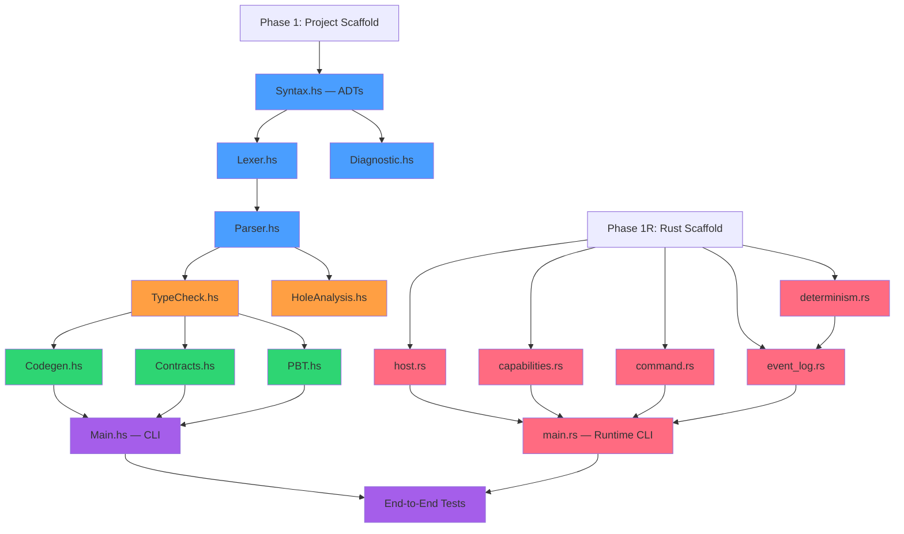

# LLMLL v0.1 — Multi-Agent Task Distribution

This document optimizes the implementation plan for parallel execution across multiple coding agents. The key insight is that the Haskell compiler has a clear dependency DAG with two wide parallel tiers, and the Rust runtime is almost entirely independent.

---

## Dependency Graph



---

## Agent Assignments

### Agent A — Haskell Core (Foundation)

**Scope:** Project scaffold + AST + Lexer + Parser — the serial dependency chain that everything else depends on.

| Phase | Task | Depends On | Est. Effort |
|---|---|---|---|
| 1 | Stack project init, `package.yaml`, dependencies | — | Small |
| 2 | `Syntax.hs` — all ADTs (`Type`, `Expr`, `HoleKind`, `Statement`, etc.) | Phase 1 | Medium |
| 2 | `Diagnostic.hs` — error type + S-exp/JSON serialization | Phase 1 | Small |
| 3 | `Lexer.hs` — Megaparsec tokenizer, all token types, spans | `Syntax.hs` | Medium |
| 4 | `Parser.hs` — S-expression → AST, all constructs | `Lexer.hs` | Large |

**Deliverable:** A working `stack build` that can parse any `.llmll` file from the spec into a typed AST. All downstream agents import this output.

**Context needed:** `LLMLL.md` (spec), `implementation_plan.md`

**Exit criteria:** `stack test` passes for lexer + parser tests against all code examples from Sections 3–11 of the spec.

---

### Agent B — Haskell Analysis (Type System)

**Scope:** Type checker + Hole analysis. **Starts after Agent A delivers `Syntax.hs` + `Parser.hs`.**

| Phase | Task | Depends On | Est. Effort |
|---|---|---|---|
| 5 | `TypeCheck.hs` — monadic type checker, bidirectional inference, immutability, all validations | `Parser.hs` | Large |
| 6 | `HoleAnalysis.hs` — AST traversal, hole catalog, structured report | `Parser.hs` | Small |

**Deliverable:** `llmll check <file>` works: parses, type-checks, reports holes.

**Context needed:** `LLMLL.md`, `Syntax.hs`, `Parser.hs` (from Agent A)

**Exit criteria:** Type checker correctly handles `withdraw`, `handle-request`, `login-route`, and delegation examples from the spec. Rejects reassignment. Computes `ReplayStatus`.

---

### Agent C — Haskell Verification (Contracts + PBT)

**Scope:** Contract instrumentation + Property-based testing. **Starts after Agent B delivers `TypeCheck.hs`.**

| Phase | Task | Depends On | Est. Effort |
|---|---|---|---|
| 7 | `Contracts.hs` — AST transform, pre/post assertion wrapping | `TypeCheck.hs` | Medium |
| 8 | `PBT.hs` — QuickCheck integration, `check` block interpretation, shrinking | `TypeCheck.hs` | Medium |

**Deliverable:** `llmll test <file>` works: runs contracts + property tests.

**Context needed:** `LLMLL.md`, `Syntax.hs`, `TypeCheck.hs` (from Agent B)

**Exit criteria:** Pre/post violations caught on `withdraw` with bad inputs. `check "Addition is commutative"` passes. Deliberate property violation produces shrunk counterexample.

---

### Agent D — Haskell Codegen + CLI

**Scope:** Rust code emission + CLI harness. **Starts after Agent B delivers `TypeCheck.hs`.** Can run in parallel with Agent C.

| Phase | Task | Depends On | Est. Effort |
|---|---|---|---|
| 9 | `Codegen.hs` — typed AST → Rust source, type mapping, Cargo.toml emission | `TypeCheck.hs` | Large |
| 10 | `Main.hs` — CLI (`check`, `test`, `build`, `holes`), `optparse-applicative` | `Codegen.hs`, `Contracts.hs`, `PBT.hs` | Medium |

**Deliverable:** `llmll build <file> -o <dir>` produces a valid Rust/WASM project.

**Context needed:** `LLMLL.md`, `Syntax.hs`, `TypeCheck.hs` (from Agent B), Rust type mapping table from implementation plan

**Exit criteria:** `withdraw.llmll` → Rust source that compiles with `cargo build --target wasm32-wasi`. Holes emit `compile_error!()`.

> **Note:** `Main.hs` (CLI) is the integration point — it needs `Contracts.hs` and `PBT.hs` from Agent C. Agent D can build `Codegen.hs` in parallel with Agent C, but `Main.hs` needs both to finish. Agent D should build `Main.hs` last.

---

### Agent E — Rust Runtime (Independent)

**Scope:** The entire Rust runtime. **Runs fully in parallel with Agents A–D** since it has zero Haskell dependencies. Needs only the spec for the Command/Response protocol and Event Log format.

| Phase | Task | Depends On | Est. Effort |
|---|---|---|---|
| 11 | `Cargo.toml` + project scaffold | — | Small |
| 11 | `host.rs` — Wasmtime setup, WASI config | — | Medium |
| 11 | `capabilities.rs` — capability manifest, allow/deny | — | Medium |
| 11 | `command.rs` — Command/Response loop | — | Medium |
| 11 | `event_log.rs` — record + replay | — | Medium |
| 11 | `determinism.rs` — clock/PRNG virtualization | — | Medium |
| 11 | `main.rs` — `run` + `replay` CLI | All above | Small |

**Deliverable:** `llmll-runtime run <file.wasm>` executes a WASM module with capability sandbox and event log.

**Context needed:** `LLMLL.md` (Sections 7, 9, 10, 10a only), `implementation_plan.md` (runtime section)

**Exit criteria:** Can load and execute a hand-written WASM module. Capabilities enforced. Event log round-trips (record → replay produces identical output).

---

## Parallel Execution Timeline

```
Time ──────────────────────────────────────────────────────────►

Agent A  ██████████████████████████████░░░░░░░░░░░░░░░░░░░░░░░░
         Scaffold → Syntax → Lexer → Parser
                                          │
Agent B  ░░░░░░░░░░░░░░░░░░░░░░░░░░░░░░░░████████████████░░░░░░
                                          TypeCheck → HoleAnalysis
                                                             │
Agent C  ░░░░░░░░░░░░░░░░░░░░░░░░░░░░░░░░░░░░░░░░░░░░░░░░░██████████
                                                             Contracts → PBT
                                                             │
Agent D  ░░░░░░░░░░░░░░░░░░░░░░░░░░░░░░░░░░░░░░░░░░░░░░░░░██████████████
                                                             Codegen ─────→ CLI
                                                                            (waits for C)

Agent E  ██████████████████████████████████████████████████████████████████
         Rust runtime (fully independent)

         ░░░░░░░░░░░░░░░░░░░░░░░░░░░░░░░░░░░░░░░░░░░░░░░░░░░░░░░░░░░░░██
                                                                         E2E
```

### Critical Path

**A → B → { C, D } → CLI → E2E**

The critical path runs through Agent A (foundation), then Agent B (type checker), then splits to C and D in parallel. Agent E runs the entire time independently. The bottleneck is Agent A's parser — everything downstream waits on it.

---

## Agent Kickoff Prompts

Each agent should receive:

1. **`LLMLL.md`** — full spec
2. **`implementation_plan.md`** — architecture overview
3. **This document** — their specific assignment section
4. **Upstream deliverables** — source files from prior agents (when applicable)

### Recommended context per agent:

| Agent | Required Files |
|---|---|
| A | `LLMLL.md`, `implementation_plan.md` |
| B | `LLMLL.md`, `implementation_plan.md`, `Syntax.hs`, `Lexer.hs`, `Parser.hs` (from A) |
| C | `LLMLL.md`, `implementation_plan.md`, `Syntax.hs`, `TypeCheck.hs` (from B) |
| D | `LLMLL.md`, `implementation_plan.md`, `Syntax.hs`, `TypeCheck.hs` (from B) |
| E | `LLMLL.md` (Sections 7, 9, 10, 10a), `implementation_plan.md` (runtime section) |

---

## Risk Mitigation

| Risk | Mitigation |
|---|---|
| Agent A's AST design doesn't serve downstream needs | Agent A should design `Syntax.hs` ADTs with B, C, D needs in mind. Review ADTs before proceeding to Lexer. |
| Type checker (B) takes longer than expected | This is the hardest phase. Budget extra time. Have Agent D start `Codegen.hs` stubs using `Syntax.hs` types directly while waiting for full `TypeCheck.hs`. |
| Codegen (D) generates invalid Rust | Gate on `rustc` compilation of generated output. Include Rust compilation as a test in Agent D's test suite. |
| Runtime (E) and compiler (D) disagree on Command protocol | Define a shared protocol spec (a markdown doc or JSON schema) before either agent starts. Both agents implement against the spec. |
