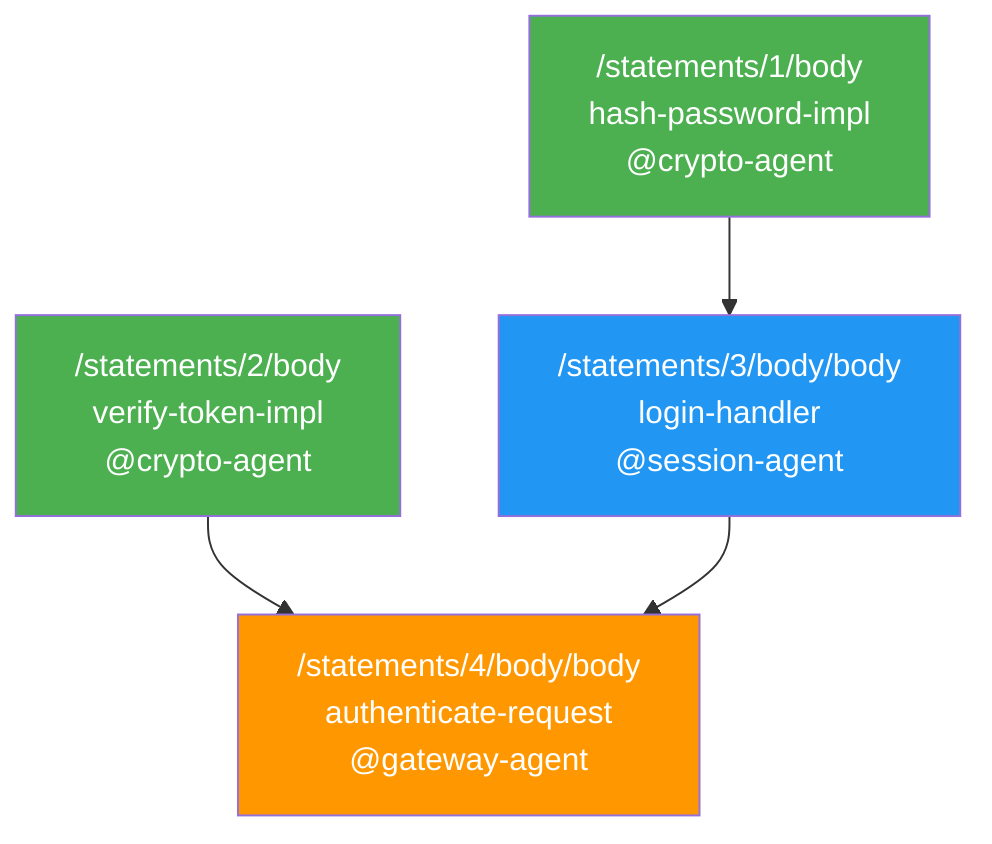
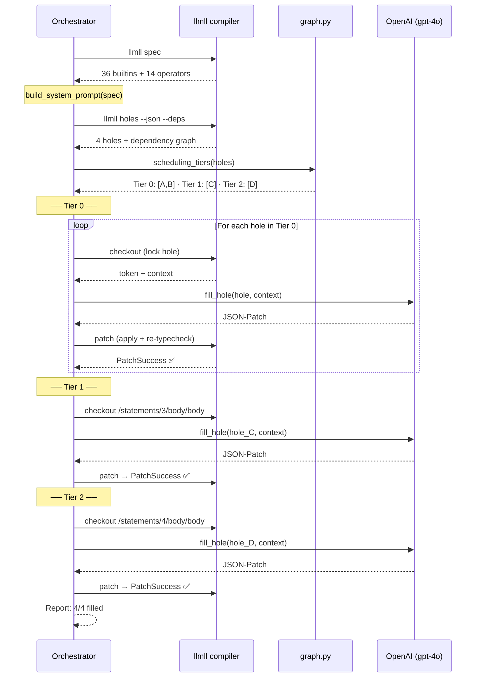
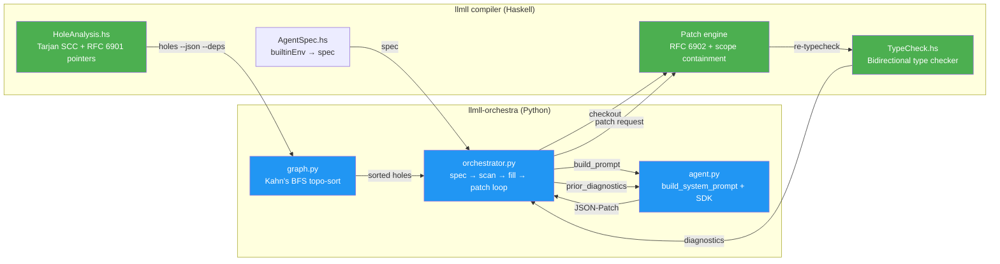

# Compiler-Mediated LLM Orchestration: From Typed Skeletons to Verified Programs

### How LLM Agents Fill Code Holes — An End-to-End Walkthrough

> **The orchestrator is a compile-time, dependency-driven scheduler:** it asks the compiler to extract typed holes and their dependencies from a partial program, dispatches each synthesis obligation to the assigned agent, and only commits patches that re-type-check.

> You write the skeleton. The agents write the code. The compiler keeps everyone honest.

---

## Why This Matters

LLM-generated code is unreliable. Current approaches handle this in one of two
ways — neither satisfactory:

1. **Generate and pray.** Line-level code assistants (Copilot, Cursor) operate
   at the function level with no global typing constraints. The programmer
   inspects each suggestion manually. There is no structural guarantee that
   generated code composes correctly across function boundaries.

2. **Test and retry.** Multi-agent frameworks (AutoGen, CrewAI, ChatDev)
   coordinate at the task level — "you write the database layer, I'll write the
   API." But they have no mechanism for type-safe composition. If Agent A's
   output is incompatible with Agent B's expectations, the error surfaces at
   integration time, not at generation time.

**The insight.** If you design a programming language with *typed holes*, you get
three things for free:

1. **A specification for each agent.** Every hole carries a type signature that
   the fill must satisfy. The agent knows exactly what to produce.
2. **A dependency ordering for scheduling.** The compiler's call-graph analysis
   derives a DAG of synthesis obligations. Holes that don't depend on each other
   can be filled in parallel; holes that do are ordered automatically.
3. **A soundness check for every fill.** The compiler re-type-checks the entire
   program after each patch. A bad fill is rejected with structured diagnostics,
   not discovered at runtime.

This is what `llmll-orchestra` does. This document walks through the entire
pipeline, from a program with four empty holes to a running Haskell application,
using OpenAI's `gpt-4o` as the agent brain.

This is not a runtime orchestrator in the usual LangChain / agent-router sense.
It does not decide, step by step, which tool or agent should act next in an
open-ended conversation. Instead, orchestration happens *before* execution: the
compiler extracts a dependency graph from typed holes, and that graph fixes the
fill order ahead of time. In that sense, the system is closer to a build planner
plus patch executor than to a conversational router.

---

## Conceptual Model

The orchestration system instantiates well-known PL concepts in a multi-agent
code generation setting. Understanding these connections clarifies the formal
properties and makes it easier to reason about correctness.

| Engineering term | Formal analogue |
|---|---|
| `?delegate` hole | **Metavariable** in a partial proof term — a placeholder with a known type that must be filled with a term of that type |
| Hole dependency graph | **Obligation ordering** — the same structure that proof assistants use to determine which goals must be solved before others |
| `checkout` + `patch` | **Exclusive term-refinement step** — only one agent may refine a given metavariable at a time, preventing conflicting substitutions |
| Compiler re-type-check | **Typing judgment verification** — each fill must satisfy a local typing judgment Γ ⊢ e : τ where Γ includes all in-scope bindings and τ is the hole's expected type |
| Retry with diagnostics | **Counterexample-guided synthesis (CEGIS)** — the compiler acts as a verifier that rejects ill-typed terms and provides counterexample diagnostics, guiding the next synthesis attempt |

These are not analogies — they are the same constructions. The dependency graph
*is* a topological ordering over synthesis obligations. The retry loop *is*
CEGIS with the type checker as the verifier. The compiler-in-the-loop
architecture transforms LLM code generation from an open-loop guess into a
closed-loop synthesis process.

---

## What You'll Build

A multi-agent authentication system with three specialist agents:

| Agent | Responsibility |
|-------|---------------|
| `@crypto-agent` | Password hashing, token verification |
| `@session-agent` | Session creation from hashed credentials |
| `@gateway-agent` | Authentication decision-making |

The key insight is that these holes have **dependencies**. You can't create a
session until the password is hashed. You can't make an authentication decision
until you have both a session and a token verification. The orchestrator figures
out this ordering automatically.

```
Tier 0 (run in parallel):  hash-password-impl ──┐
                            verify-token-impl ───┼─┐
                                                 │ │
Tier 1 (waits for Tier 0):  login-handler ───────┘ │
                                                   │
Tier 2 (waits for Tier 1):  authenticate-request ──┘
```

---

## Before We Start

You'll need:

```bash
# Build the compiler (GHC ≥ 9.4, Stack ≥ 2.9)
cd compiler && stack build

# Install the orchestrator
cd tools/llmll-orchestra && pip install -e .

# Set your API key
export OPENAI_API_KEY=sk-proj-...
```

---

## Step 1: Write the Skeleton

The lead agent (that's you, for now) writes the program structure. Every
function body that needs an agent's help is marked with `?delegate`.

Here's the full program in S-expression form. Don't worry about the JSON-AST
yet — we'll show both formats for each piece as we go.

```lisp
;;; ── The contract boundary: what methods exist ────────────────────
(def-interface AuthSystem
  [hash-password (fn [raw-pw: string] -> string)]
  [verify-token  (fn [token: string]  -> bool)])
```

> **Why the interface?** `AuthSystem` declares the API shape — it specifies
> what methods must exist and their type signatures. In the current system, the
> relationship between an interface and its implementing functions is
> *structural*, not nominal: the compiler checks that implementations match the
> declared types, but there is no explicit `impl AuthSystem` construct. The
> interface serves as a contract boundary that agents and humans can inspect
> without reading implementations.

```lisp
;;; ── Two independent low-level implementations ───────────────────

(def-logic hash-password-impl [raw-pw: string]
  (?delegate @crypto-agent
    "Hash the raw password using a salt-based scheme.
     Concatenate a fixed salt with the password, compute a digest
     representation, and return the hashed string prefixed with 'hashed:'."
    :return-type string
    :on-failure "hash-unavailable"))

(def-logic verify-token-impl [token: string]
  (?delegate @crypto-agent
    "Verify the session token is well-formed and not expired.
     Reject empty tokens. Valid tokens must be at least 8 characters.
     Return true if valid, false otherwise."
    :return-type bool
    :on-failure false))

;;; ── A higher-level function that DEPENDS on hash-password-impl ──

(def-logic login-handler [username: string password: string]
  (pre (not (= (string-length password) 0)))
  (let [(hashed (hash-password-impl password))]     ; ← this creates a dependency!
    (?delegate @session-agent
      "Using the hashed password and the username, build a session token.
       If the hash failed, return an error. Otherwise concatenate
       username:hashed into a session ID. Return Result[string, string]."
      :return-type Result[string, string]
      :on-failure (err "session-agent unavailable"))))

;;; ── The top-level entry point: depends on EVERYTHING above ──────

(def-logic authenticate-request
    [username: string password: string existing-token: string]
  (let [(token-valid (verify-token-impl existing-token))  ; ← dep on Tier 0
        (session     (login-handler username password))]  ; ← dep on Tier 1
    (?delegate @gateway-agent
      "If token-valid is true, return ok with existing-token (reuse).
       Otherwise, pattern-match on session: on Success return ok with
       the new session ID, on Error propagate. Return Result[string, string]."
      :return-type Result[string, string]
      :on-failure (err "gateway-agent unavailable"))))
```

A few things to notice:

- **`?delegate`** is a typed hole. It tells the compiler "an agent will fill
  this" and declares the expected return type. If the agent's patch doesn't
  match, the compiler rejects it.

- **`on-failure`** is the runtime fallback. If `@crypto-agent` crashes at
  runtime, `hash-password-impl` returns `"hash-unavailable"` instead of
  exploding. It has nothing to do with orchestration-time filling.

- **Dependencies come from `let` bindings.** When `login-handler`'s body is a
  `let` that calls `hash-password-impl` (which has a hole), the compiler
  detects that `login-handler`'s hole *depends on* `hash-password-impl`'s hole.

The full JSON-AST for this program is at
[`examples/orchestrator_walkthrough/auth_module.ast.json`](../examples/orchestrator_walkthrough/auth_module.ast.json).

Let's verify it type-checks:

```bash
$ stack exec llmll -- check ../examples/orchestrator_walkthrough/auth_module.ast.json
✅ auth_module.ast.json — OK (5 statements)
```

Five statements: one interface, four functions. Four of those functions have
holes. Let's see what the compiler knows about them.

---

## Step 2: Scan the Holes

The compiler's `holes` command catalogs every hole in the program. With `--deps`,
it also computes a dependency graph showing which holes block which others:

```bash
$ stack exec llmll -- --json holes --deps ../examples/orchestrator_walkthrough/auth_module.ast.json
```

Here's the output, annotated:

```json
[
  {
    "pointer":      "/statements/1/body",          // ← RFC 6901 path into the AST
    "kind":         "delegate",
    "status":       "agent-task",
    "agent":        "@crypto-agent",
    "module-path":  "def-logic hash-password-impl",
    "depends_on":   [],                            // ← no dependencies: leaf node
    "cycle_warning": false
  },
  {
    "pointer":      "/statements/2/body",
    "kind":         "delegate",
    "agent":        "@crypto-agent",
    "module-path":  "def-logic verify-token-impl",
    "depends_on":   [],                            // ← another leaf node
    "cycle_warning": false
  },
  {
    "pointer":      "/statements/3/body/body",     // ← note: body/body (inside the let)
    "kind":         "delegate",
    "agent":        "@session-agent",
    "module-path":  "def-logic login-handler",
    "depends_on": [
      {
        "pointer": "/statements/1/body",           // ← depends on hash-password-impl
        "via":     "hash-password-impl",
        "reason":  "calls-hole-body"
      }
    ],
    "cycle_warning": false
  },
  {
    "pointer":      "/statements/4/body/body",
    "kind":         "delegate",
    "agent":        "@gateway-agent",
    "module-path":  "def-logic authenticate-request",
    "depends_on": [
      {
        "pointer": "/statements/2/body",           // ← depends on verify-token-impl
        "via":     "verify-token-impl",
        "reason":  "calls-hole-body"
      },
      {
        "pointer": "/statements/3/body/body",      // ← AND depends on login-handler
        "via":     "login-handler",
        "reason":  "calls-hole-body"
      }
    ],
    "cycle_warning": false
  }
]
```

The `pointer` field is important. It's an RFC 6901 JSON Pointer that tells you
exactly where in the AST the hole lives. Notice that `login-handler`'s hole is
at `/statements/3/body/body` — not `/statements/3/body`. That's because the
function body is a `let` expression, and the hole is the `let`'s inner body.
The outer `let` structure (with the `hashed` binding) stays in place.

The dependency graph reads naturally:
- `hash-password-impl` and `verify-token-impl` → no deps → **Tier 0**
- `login-handler` → depends on `hash-password-impl` → **Tier 1**
- `authenticate-request` → depends on both `verify-token-impl` and `login-handler` → **Tier 2**

### How Does the Compiler Know About Dependencies?

The dependency computation involves two algorithms in two stages:

**Stage 1: Cycle detection (Tarjan's SCC — compiler, Haskell).** The compiler's
[`HoleAnalysis.hs`](../compiler/src/LLMLL/HoleAnalysis.hs)
walks the call graph and builds edges between holes. A dependency edge exists
when a function's body *calls* another function whose body is a hole. Transitive
calls through intermediate non-hole functions create transitive edges. Tarjan's
Strongly Connected Components algorithm detects mutual recursion: if two holes
depend on each other cyclically, the compiler breaks the cycle deterministically
(by assigning one to a lower tier) and sets `cycle_warning: true`.

**Stage 2: Topological sorting (Kahn's algorithm — orchestrator, Python).** The
DAG produced by Stage 1 feeds into `graph.py`, which runs Kahn's BFS-based
topological sort to produce scheduling tiers. Each tier contains holes that can
be filled independently once all prior tiers are complete.

**Soundness of parallel filling.** Holes in the same tier have *disjoint
dependency cones* — filling one cannot affect the typing judgment of the other.
This is because: (a) each hole's typing context Γ is determined by its position
in the AST, not by the bodies of sibling holes; and (b) `checkout` enforces
exclusive access, so no two patches can modify overlapping subtrees. This
invariant justifies filling Tier 0 holes in parallel without risk of
interference.

> **What just happened:** The compiler scanned the AST, found four holes, computed their dependencies via call-graph analysis, and produced a three-tier scheduling DAG. No agents were invoked — this is all compile-time analysis.

---

## Step 3: Schedule and Sort

The orchestrator's `graph.py` module takes the hole report and produces
scheduling tiers using Kahn's algorithm (topological sort via BFS):

```
Tier 0 (parallel):  /statements/1/body       [@crypto-agent]
                    /statements/2/body       [@crypto-agent]

Tier 1:            /statements/3/body/body  [@session-agent]

Tier 2:            /statements/4/body/body  [@gateway-agent]
```

You can see this yourself without making any API calls:

```bash
$ llmll-orchestra ../examples/orchestrator_walkthrough/auth_module.ast.json --scan-only
auth_module.ast.json — 4 holes (4 fillable)

  Tier 0 (parallel):
    /statements/1/body [@crypto-agent]
    /statements/2/body [@crypto-agent]

  Tier 1 (parallel):
    /statements/3/body/body [@session-agent] ← depends on: hash-password-impl

  Tier 2 (parallel):
    /statements/4/body/body [@gateway-agent] ← depends on: verify-token-impl, login-handler
```

The tiers tell the orchestrator: "fill Tier 0 first (both in parallel if you
want), then Tier 1, then Tier 2." This ordering guarantees that by the time we
fill `login-handler`, the function it calls (`hash-password-impl`) already has
a concrete body. The agent filling Tier 1 can reason about what `hash-password-impl`
actually does, not just its type signature.



> **What just happened:** The orchestrator consumed the compiler's dependency graph and produced a concrete execution plan — three tiers with four holes. The plan is deterministic: given the same program, the same tiers appear in the same order.

---

## Step 4: Fill the Holes

Now the real work begins. For each hole, the orchestrator runs a tight loop:

1. **Checkout** — lock the hole so nobody else touches it
2. **Prompt** — tell the agent what to fill and give it context
3. **Call OpenAI** — get a JSON-Patch response
4. **Apply** — feed the patch to the compiler, which re-type-checks everything
5. **Retry** — if the compiler rejects, send the diagnostics back to the agent

Let's walk through each hole.

---

### Hole A: `hash-password-impl` (Tier 0, @crypto-agent)

**The hole sits at:** `/statements/1/body`

**What the agent sees** (user prompt built by `agent.py:build_prompt()`):

```
## Hole to fill

- **Pointer:** `/statements/1/body`
- **Kind:** `delegate`
- **Context:** `def-logic hash-password-impl`
- **Description:** hole: ?delegate @@crypto-agent
- **Target agent:** `@crypto-agent`

Return a JSON array of RFC 6902 patch operations to fill this hole.
```

The system prompt tells the agent which AST node kinds are valid (`lit-int`,
`var`, `app`, `let`, `if`, `match`, etc.) and instructs it to return *only* a
JSON array — no commentary, no markdown fences.

> **v0.3.4 note:** The system prompt is no longer hardcoded. At startup, the
> orchestrator calls `llmll spec` to fetch the complete list of built-in
> functions, operators, constructors, and type nodes directly from the compiler's
> `builtinEnv`. This means adding a new builtin to the compiler automatically
> makes it available to agents — no manual prompt editing required. If the
> compiler doesn't support `spec` (pre-v0.3.4), the orchestrator falls back to a
> static legacy reference.

**What the agent returns:**

```json
[{
  "op": "replace",
  "path": "/statements/1/body",
  "value": {
    "kind": "let",
    "bindings": [
      {"name": "salt",   "expr": {"kind": "lit-string", "value": "llmll-v1-salt"}},
      {"name": "salted", "expr": {"kind": "app", "fn": "string-concat",
                                   "args": [{"kind": "var", "name": "salt"},
                                            {"kind": "var", "name": "raw-pw"}]}},
      {"name": "digest", "expr": {"kind": "app", "fn": "int-to-string",
                                   "args": [{"kind": "app", "fn": "string-length",
                                             "args": [{"kind": "var", "name": "salted"}]}]}}
    ],
    "body": {"kind": "app", "fn": "string-concat",
             "args": [{"kind": "lit-string", "value": "hashed:"},
                      {"kind": "var", "name": "digest"}]}
  }
}]
```

In S-expression, that reads:

```lisp
(let [(salt   "llmll-v1-salt")
      (salted (string-concat salt raw-pw))
      (digest (int-to-string (string-length salted)))]
  (string-concat "hashed:" digest))
```

The agent prepends a fixed salt, concatenates it with the raw password, and uses
the combined string's *length* as a "digest." The result is something like
`"hashed:19"`. This is a **structural stand-in** for a real hash function — the
type system guarantees that the return type is `string` (structural correctness),
but it makes no claim about cryptographic soundness (semantic correctness). This
distinction is precisely the gap that contracts and the verification pipeline
(`llmll verify`) are designed to close: a `post` condition on `hash-password-impl`
could specify that the output is non-reversible, and the verifier would check it.

**What happens under the hood:**

```python
# orchestrator.py — _fill_one()

# 1. Lock the hole
token = compiler.checkout(source, "/statements/1/body")

# 2. Ask the agent
response = agent.fill_hole(hole, token.context)

# 3. Wrap in a PatchRequest and apply
patch_request = {"token": token.token, "patch": response.patch_ops}
result = compiler.patch(source, patch_file)

# 4. Compiler re-type-checks automatically
# result = {"success": True}  ← the fill matched the expected type (string)
```

**What did the compiler actually check?** When `llmll patch` succeeds, it has
verified the *entire program* — not just the patched subtree. The type checker
runs bidirectionally: it checks that the patched expression has the expected
return type (`string`), and it also verifies that all sub-expressions within the
fill are well-typed (e.g., that `string-concat` receives two `string` arguments).
Runtime contracts like the `pre` condition on `login-handler` are compiled as
runtime assertions — they are syntactically valid after patching but not
statically re-verified at this stage. Static contract verification happens via
`llmll verify` on the completed program.

✅ Compiler says yes. The hole is filled. The lock is released.

---

### Hole B: `verify-token-impl` (Tier 0, @crypto-agent)

Since Holes A and B are both in Tier 0, they could technically run in parallel.
The current orchestrator fills them sequentially, but the *ordering* between A
and B doesn't matter — neither depends on the other.

**The agent returns:**

```json
[{
  "op": "replace",
  "path": "/statements/2/body",
  "value": {
    "kind": "if",
    "cond": {"kind": "op", "op": "=",
             "args": [{"kind": "app", "fn": "string-length",
                        "args": [{"kind": "var", "name": "token"}]},
                      {"kind": "lit-int", "value": 0}]},
    "then_branch": {"kind": "lit-bool", "value": false},
    "else_branch": {"kind": "op", "op": ">=",
                    "args": [{"kind": "app", "fn": "string-length",
                              "args": [{"kind": "var", "name": "token"}]},
                             {"kind": "lit-int", "value": 8}]}
  }
}]
```

In S-expression:

```lisp
(if (= (string-length token) 0)
    false
    (>= (string-length token) 8))
```

Empty token? Rejected. Otherwise, valid if length ≥ 8. This is fail-closed:
the `on_failure` fallback in the original skeleton also returns `false`, so
whether the agent crashes at runtime or the token is bad, the answer is always
"no."

✅ Both Tier 0 holes are done.

---

### Hole C: `login-handler` (Tier 1, @session-agent)

This is where dependencies get interesting.

The hole is at `/statements/3/body/body` — the inner body of a `let`. The outer
`let` binding `hashed = (hash-password-impl password)` is already in the program
and will stay in place. The agent only fills the body that *uses* `hashed`.

In scope when the agent writes its fill:
- `username` (from the function params)
- `password` (from the function params)
- `hashed` (from the `let` binding — result of calling `hash-password-impl`)

**The agent returns:**

```json
[{
  "op": "replace",
  "path": "/statements/3/body/body",
  "value": {
    "kind": "if",
    "cond": {"kind": "op", "op": "=",
             "args": [{"kind": "var", "name": "hashed"},
                      {"kind": "lit-string", "value": "hash-unavailable"}]},
    "then_branch": {"kind": "app", "fn": "err",
                    "args": [{"kind": "lit-string",
                              "value": "crypto agent failed to hash password"}]},
    "else_branch": {"kind": "app", "fn": "ok",
                    "args": [{"kind": "app", "fn": "string-concat",
                              "args": [{"kind": "lit-string", "value": "session:"},
                                       {"kind": "app", "fn": "string-concat",
                                        "args": [{"kind": "var", "name": "username"},
                                                 {"kind": "app", "fn": "string-concat",
                                                  "args": [{"kind": "lit-string", "value": ":"},
                                                           {"kind": "var", "name": "hashed"}]}]}]}]}
  }
}]
```

In S-expression:

```lisp
;; In scope: username, password, hashed
(if (= hashed "hash-unavailable")
    (err "crypto agent failed to hash password")
    (ok (string-concat "session:"
          (string-concat username
            (string-concat ":" hashed)))))
```

The agent checks if the hash call fell back to `"hash-unavailable"`
(the `on_failure` sentinel from `hash-password-impl`). If the hash worked, it
builds a session ID like `"session:alice:hashed:19"` and wraps it in `ok`.

> **Sentinel-value protocol.** This pattern creates an implicit runtime contract
> between agents: the session agent must know the exact sentinel value that the
> crypto agent's `on_failure` produces. If `hash-password-impl` could
> *legitimately* return `"hash-unavailable"` as a hashed value (pathological,
> but the types permit it), the session agent would silently misroute. This is
> a semantic gap that the type system alone cannot close — a `post` contract on
> `hash-password-impl` (e.g., "output always starts with 'hashed:'") would make
> the invariant explicit and verifiable.

The return type is `Result[string, string]`, matching the delegate declaration.
The compiler verifies this during patching.

---

### Hole D: `authenticate-request` (Tier 2, @gateway-agent)

The deepest hole. Its `let` bindings call both `verify-token-impl` (Tier 0) and
`login-handler` (Tier 1), giving this agent two variables to work with:

- `token-valid` — a `bool` from verifying the existing token
- `session` — a `Result[string, string]` from attempting a fresh login

**The agent returns:**

```json
[{
  "op": "replace",
  "path": "/statements/4/body/body",
  "value": {
    "kind": "if",
    "cond": {"kind": "var", "name": "token-valid"},
    "then_branch": {"kind": "app", "fn": "ok",
                    "args": [{"kind": "app", "fn": "string-concat",
                              "args": [{"kind": "lit-string", "value": "token-reuse:"},
                                       {"kind": "var", "name": "existing-token"}]}]},
    "else_branch": {
      "kind": "match",
      "scrutinee": {"kind": "var", "name": "session"},
      "arms": [
        {"pattern": {"kind": "constructor", "constructor": "Success",
                     "sub_patterns": [{"kind": "bind", "name": "s"}]},
         "body": {"kind": "app", "fn": "ok",
                  "args": [{"kind": "app", "fn": "string-concat",
                            "args": [{"kind": "lit-string", "value": "new-session:"},
                                     {"kind": "var", "name": "s"}]}]}},
        {"pattern": {"kind": "constructor", "constructor": "Error",
                     "sub_patterns": [{"kind": "bind", "name": "e"}]},
         "body": {"kind": "app", "fn": "err",
                  "args": [{"kind": "app", "fn": "string-concat",
                            "args": [{"kind": "lit-string", "value": "login-failed:"},
                                     {"kind": "var", "name": "e"}]}]}}
      ]
    }
  }
}]
```

In S-expression:

```lisp
;; In scope: username, password, existing-token, token-valid, session
(if token-valid
    (ok (string-concat "token-reuse:" existing-token))
    (match session
      ((Success s) (ok (string-concat "new-session:" s)))
      ((Error e)   (err (string-concat "login-failed:" e)))))
```

Two paths:
1. **Existing token is valid?** Reuse it. No password hashing needed.
2. **Not valid?** Fall through to the fresh login result and pattern-match.
   On `Success`, wrap the new session. On `Error`, propagate with a prefix.

✅ All four holes are filled.

> **What just happened:** Four agents filled four holes across three tiers. Each fill was type-checked by the compiler before being committed. The dependency ordering ensured that later agents could reason about the concrete implementations of earlier fills, not just their type signatures.

---

## What If the Agent Gets It Wrong?

Here's the flow when things go sideways — say the agent returns an expression
that doesn't type-check:

```
Agent returns:  {"kind": "lit-int", "value": 42}
                                    ↓
Compiler:       "type mismatch: expected string, got int"
                                    ↓
Orchestrator:   Feeds diagnostics back to the agent via prior_diagnostics
                                    ↓
Agent (retry):  Gets the error in its next prompt, corrects the fill
                                    ↓
Compiler:       ✅ PatchSuccess
```

In code:

```python
# orchestrator.py — retry loop
for attempt in range(1, max_retries + 1):
    aug_context = dict(context)
    if diagnostics:
        aug_context["prior_diagnostics"] = diagnostics   # ← agent sees the error

    response = agent.fill_hole(hole, aug_context)
    result = compiler.patch(source, patch_file)

    if result["success"]:
        return HoleResult(success=True, ...)
    else:
        diagnostics = result["diagnostics"]              # ← try again

# All retries exhausted
compiler.release(source, hole.pointer)                   # ← release the lock
return HoleResult(success=False, error=last_error)
```

The compiler returns structured diagnostics with JSON Pointers into the patch,
so the agent knows *which part* of its fill is wrong. Up to 3 retries are
attempted by default (`--max-retries`).

**What happens when all retries fail?** The AST is left with the original hole
intact — the `patch` command is atomic, so a failed fill never commits. The
orchestrator marks the hole as failed and continues to the next tier. Subsequent
holes that *depend* on the failed hole are **skipped** (their dependency is
unresolved), while independent holes in the same or later tiers proceed
normally. The final report shows which holes succeeded, which failed, and which
were skipped due to unresolved dependencies.

---

## Step 5: See the Result

After all four holes are filled, let's verify the program is complete:

```bash
$ stack exec llmll -- check ../examples/orchestrator_walkthrough/auth_module_filled.ast.json
✅ auth_module_filled.ast.json — OK (5 statements)

$ stack exec llmll -- holes ../examples/orchestrator_walkthrough/auth_module_filled.ast.json
auth_module_filled.ast.json — 0 holes (0 blocking)
```

Zero holes. The program is whole.

Here's the complete filled program in S-expression:

```lisp
(def-interface AuthSystem
  [hash-password (fn [raw-pw: string] -> string)]
  [verify-token  (fn [token: string]  -> bool)])

(def-logic hash-password-impl [raw-pw: string]
  (let [(salt   "llmll-v1-salt")
        (salted (string-concat salt raw-pw))
        (digest (int-to-string (string-length salted)))]
    (string-concat "hashed:" digest)))

(def-logic verify-token-impl [token: string]
  (if (= (string-length token) 0)
      false
      (>= (string-length token) 8)))

(def-logic login-handler [username: string password: string]
  (pre (not (= (string-length password) 0)))
  (let [(hashed (hash-password-impl password))]
    (if (= hashed "hash-unavailable")
        (err "crypto agent failed to hash password")
        (ok (string-concat "session:"
              (string-concat username
                (string-concat ":" hashed)))))))

(def-logic authenticate-request
    [username: string password: string existing-token: string]
  (let [(token-valid (verify-token-impl existing-token))
        (session     (login-handler username password))]
    (if token-valid
        (ok (string-concat "token-reuse:" existing-token))
        (match session
          ((Success s) (ok (string-concat "new-session:" s)))
          ((Error e)   (err (string-concat "login-failed:" e)))))))
```

---

## Step 6: Compile and Run

The llmll compiler generates a standalone Haskell package:

```bash
$ stack exec llmll -- build auth_module_filled.ast.json \
    -o ../generated/orchestrator_walkthrough --emit-only
OK Generated Haskell package from JSON-AST: ../generated/orchestrator_walkthrough
```

> **`Result[ok, err]` → `Either err ok` — constructor order flips.** This is
> a critical detail for agents generating `match` arms. LLMLL's `Result[ok, err]`
> compiles to Haskell's `Either err ok`. `Success` → `Right`, `Error` → `Left`.
> The `ok`/`err` helper functions are just aliases for `Right`/`Left`. If an agent
> emits pattern arms in the wrong order, the generated Haskell will still
> compile (both arms have the same wrapping structure) but will silently swap
> success and error paths.

The generated Haskell (with comments added for clarity):

```haskell
-- ─── Interface ──────────────────────────────────────────────────────
class AuthSystem t where
  hash_password :: t -> a -> String
  verify_token  :: t -> a -> Bool

-- ─── Tier 0: @crypto-agent filled these ─────────────────────────────

hash_password_impl raw_pw =
  let salt   = "llmll-v1-salt"
      salted = string_concat salt raw_pw
      digest = int_to_string (string_length salted)
  in  string_concat "hashed:" digest

verify_token_impl token =
  if string_length token == (0 :: Int)
    then False
    else string_length token >= (8 :: Int)

-- ─── Tier 1: @session-agent filled this ─────────────────────────────
-- pre: password is non-empty (runtime assertion)

login_handler username password =
  let _pre_ = if not (string_length password == (0 :: Int))
               then () else error "pre-condition failed"
  in  _pre_ `seq`
      let hashed = hash_password_impl password
      in  if hashed == "hash-unavailable"
            then err "crypto agent failed to hash password"
            else ok (string_concat "session:"
                      (string_concat username
                        (string_concat ":" hashed)))

-- ─── Tier 2: @gateway-agent filled this ─────────────────────────────

authenticate_request username password existing_token =
  let token_valid = verify_token_impl existing_token
      session     = login_handler username password
  in  if token_valid
        then ok (string_concat "token-reuse:" existing_token)
        else case session of
               Right s -> ok  (string_concat "new-session:" s)
               Left  e -> err (string_concat "login-failed:" e)
```

Load it in GHCi and try it out:

```bash
$ cd generated/orchestrator_walkthrough
$ stack ghci src/Lib.hs
```

```haskell
-- Hash a password
λ> hash_password_impl "s3cret"
"hashed:19"

-- Verify tokens
λ> verify_token_impl ""
False
λ> verify_token_impl "short"
False
λ> verify_token_impl "session:alice:hashed:19"
True

-- Login (pre-condition enforced at runtime)
λ> login_handler "alice" "s3cret"
Right "session:alice:hashed:19"
λ> login_handler "alice" ""
*** Exception: pre-condition failed

-- Full authentication — existing token is valid, reuse it
λ> authenticate_request "alice" "s3cret" "session:alice:hashed:19"
Right "token-reuse:session:alice:hashed:19"

-- Full authentication — no existing token, fresh login
λ> authenticate_request "bob" "p4ss" ""
Right "new-session:session:bob:hashed:17"

-- Full authentication — existing token too short, fall through to login
λ> authenticate_request "carol" "pw123" "short"
Right "new-session:session:carol:hashed:18"
```

It runs. Three agents collaborated on a single program, the compiler
type-checked every fill, and the result is a working Haskell application.

---

## Step 7: Read the Report

The orchestrator produces a summary when it's done:

```
════════════════════════════════════════════════════════
  llmll-orchestra report: auth_module.ast.json
════════════════════════════════════════════════════════
  Total holes:  4
  Filled:       4
  Failed:       0
  Skipped:      0
──────────────────────────────────────────────────────────
  ✅ /statements/1/body       [@crypto-agent]   (1 attempts)
  ✅ /statements/2/body       [@crypto-agent]   (1 attempts)
  ✅ /statements/3/body/body  [@session-agent]  (1 attempts)
  ✅ /statements/4/body/body  [@gateway-agent]  (1 attempts)
════════════════════════════════════════════════════════
```

Or as JSON (`--json`):

```json
{
  "source_file": "auth_module.ast.json",
  "total_holes": 4,
  "filled": 4,
  "failed": 0,
  "skipped": 0,
  "results": [
    {"pointer": "/statements/1/body",      "agent": "@crypto-agent",  "attempts": 1, "success": true},
    {"pointer": "/statements/2/body",      "agent": "@crypto-agent",  "attempts": 1, "success": true},
    {"pointer": "/statements/3/body/body", "agent": "@session-agent", "attempts": 1, "success": true},
    {"pointer": "/statements/4/body/body", "agent": "@gateway-agent", "attempts": 1, "success": true}
  ]
}
```

---

## Under the Hood: How It All Connects

Here's the full sequence, compressed into one diagram:



And the compiler-orchestrator feedback loop:



The critical invariant: **the compiler is never bypassed**. Every
agent-generated patch goes through the same type-checker that checks
human-written code. An agent can't insert a `lit-int` where a `string` was
expected. It can't modify nodes outside its checked-out subtree. And if it gets
something wrong, the diagnostics tell it exactly what to fix.

---

## Related Work

The orchestration architecture draws on — and differs from — three lines of
prior work.

### Typed Holes in Programming Languages

**Agda** and **Idris** pioneered typed holes in dependently-typed proof
assistants: the programmer writes `?` and the system infers the required type,
enabling incremental (interactive) proof construction. **GHC's**
`-fdefer-type-errors` and typed holes (`_`) offer a similar workflow for
Haskell. **Hazel** is a live programming environment designed around typed holes
with structured editing.

LLMLL's `?delegate` differs in two ways: (1) it carries an *agent assignment*
(`@crypto-agent`) and a *runtime fallback* (`on_failure`), neither of which
exists in proof assistants; and (2) the hole's dependency graph is used for
*scheduling*, not just interactive goal display. The hole is both a synthesis
obligation and a coordination primitive.

### Program Synthesis from Types

**Synquid** and **Myth** synthesize programs from refinement types using
enumerative search. **λ²** generates recursive programs from input-output
examples constrained by types. The orchestrator's retry loop is a degenerate
form of counterexample-guided inductive synthesis (CEGIS): the LLM generates a
candidate, the type checker rejects it, the diagnostics guide the next attempt.

What LLMLL adds: the synthesizer is an LLM (not a solver), the specification
language is a general-purpose PL with contracts (not a refinement-type DSL),
and the approach handles programs with dozens of inter-dependent synthesis
obligations. The trade-off is completeness — an LLM may never find a valid fill,
whereas a solver-based synthesizer either finds one or proves none exists.

### Multi-Agent Code Generation

**ChatDev** and **MetaGPT** coordinate LLM agents via procedural chat protocols
("CEO tells CTO, CTO tells programmer"). **SWE-agent** uses a task-level loop
(edit → test → edit). These frameworks coordinate at the task level — agents
exchange natural-language instructions and untyped code.

The orchestrator's coordination is *structural*: it is derived from the
program's call graph, not from a procedural script. The dependency ordering is
automatic (computed by the compiler), the task specification is typed (each hole
has a required type), and the verification is formal (the type checker, not a
test suite, is the arbiter). This eliminates the integration-time failures that
plague procedural multi-agent coordination.

### DAG Schedulers and Build Systems

LLMLL also has an affinity with DAG schedulers and build systems such as
**Airflow** and **Bazel**. Like those systems, it executes work in dependency
order rather than in a handwritten procedural sequence. The difference is where
the graph comes from and what validity means. In Airflow or Bazel, the graph is
declared explicitly by the author and correctness is primarily operational
("can this task run now?" / "does this target depend on that one?"). In LLMLL,
the graph is *inferred* from typed holes and call structure, and each step is
revalidated by the compiler before it is committed. The result is a scheduler
whose ordering is compile-time and whose acceptance criterion is typing, not
just successful task execution.

---

## Evaluation and Open Questions

This walkthrough demonstrates the system on a single four-hole program. A
complete evaluation would need to answer:

### Quantitative Questions

- **First-attempt success rate:** What fraction of holes are filled correctly
  on the first try, without retries? On the auth module, it was 4/4. How does
  this hold for larger programs or harder specifications?
- **Retry efficiency:** When the first attempt fails, how many retries does it
  take? What fraction of holes exhaust all retries?
- **Comparison baseline:** How does first-attempt accuracy compare to
  unconstrained LLM generation (no type checking, no dependency ordering)?
  The hypothesis is that typed holes reduce retry rate by giving the agent a
  precise specification, and that dependency ordering reduces integration
  failures by ensuring agents work with concrete, not abstract, dependencies.

### Qualitative Questions

- **What does the type system catch?** Type mismatches (returning `int` where
  `string` is expected), arity errors (calling a binary operator with three
  arguments), missing pattern arms (matching on `Result` with only a `Success`
  case), scope violations (referencing a variable not in the `let` bindings).
  These are all errors that would silently compile in an untyped multi-agent
  system and surface only at runtime.
- **What does it miss?** Semantic errors (a "hash" function that returns string
  length), logical errors (checking the wrong sentinel value), performance
  issues (O(n²) string concatenation). Closing this gap requires contracts and
  verification, which the `llmll verify` pipeline provides.

### Scaling Questions

- **How many holes?** The current orchestrator fills holes sequentially within
  each tier. For programs with 50+ holes and many tiers, the sequential
  bottleneck and API latency dominate. Intra-tier parallelism would help.
- **Where does the dependency graph become a bottleneck?** For a flat program
  (many independent functions), the graph is trivial. For a deeply nested
  call chain, the graph is a long chain and parallelism is limited.
- **Cross-module orchestration:** The current system operates on a single
  file. Multi-module programs require cross-file dependency tracking and
  potentially distributed agent coordination.

---

## The Module Map

If you want to read or modify the orchestrator source:

```
tools/llmll-orchestra/llmll_orchestra/
  __main__.py       CLI entry — argparse, provider selection, scan-only mode
  compiler.py       Subprocess wrapper — spec(), holes(), checkout(), patch(), release()
  graph.py          topo_sort() via Kahn's BFS, scheduling_tiers()
  agent.py          build_system_prompt(), build_prompt(), OpenAIAgent, Agent, DryRunAgent
  orchestrator.py   The main loop: spec → scan → sort → (checkout → fill → patch → retry)*
```

```
compiler/src/LLMLL/
  AgentSpec.hs      Reads builtinEnv, emits structured spec (text or JSON)
  TypeCheck.hs      Exports builtinEnv (operator + function types)
```

---

## What Comes Next

### Try it now

```bash
# Scan only (no API calls)
llmll-orchestra examples/orchestrator_walkthrough/auth_module.ast.json --scan-only

# Dry run (stub patches, no API calls, tests the checkout/patch plumbing)
llmll-orchestra examples/orchestrator_walkthrough/auth_module.ast.json --dry-run -v

# Full run with OpenAI
export OPENAI_API_KEY=sk-proj-...
llmll-orchestra examples/orchestrator_walkthrough/auth_module.ast.json -v

# Full run with Anthropic
export ANTHROPIC_API_KEY=sk-ant-...
llmll-orchestra examples/orchestrator_walkthrough/auth_module.ast.json \
  --provider anthropic --model claude-sonnet-4-20250514 -v
```

The filled source files for this tutorial are in
[`examples/orchestrator_walkthrough/`](../examples/orchestrator_walkthrough/).

### Where the architecture goes from here

Three extensions follow naturally from the foundations described in this
document:

1. **Agent tool-use with the type checker.** The `POST /sketch` endpoint
   (already implemented in `llmll serve`) gives agents access to the type
   checker as an oracle. Instead of guessing and retrying, an agent could
   query: "Is this sub-expression well-typed in this context?" This transforms
   the architecture from open-loop synthesis (guess → check → retry) to
   closed-loop, type-directed search — the analogue of proof search in a
   tactic-based proof assistant.

2. **Contract verification on filled code.** Once all holes are filled,
   `llmll verify` can check `pre`/`post` contracts via liquid-fixpoint and Z3.
   The orchestrator could invoke verification as a final pass, producing a
   trust report that classifies each function as `proven`, `tested`, or
   `asserted`. This closes the gap between *structural* correctness (types
   match) and *semantic* correctness (behavior meets specification).

3. **Distributed multi-module orchestration.** The current system operates on
   a single file. For a real application with dozens of modules and hundreds
   of holes, the orchestrator would need cross-file dependency tracking,
   distributed agent scheduling, and merge coordination. The formal
   foundations — typed holes, dependency DAGs, scope-contained patches — extend
   naturally to this setting.
