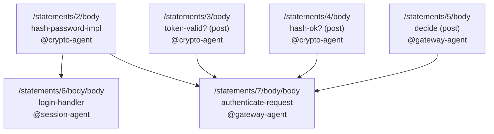
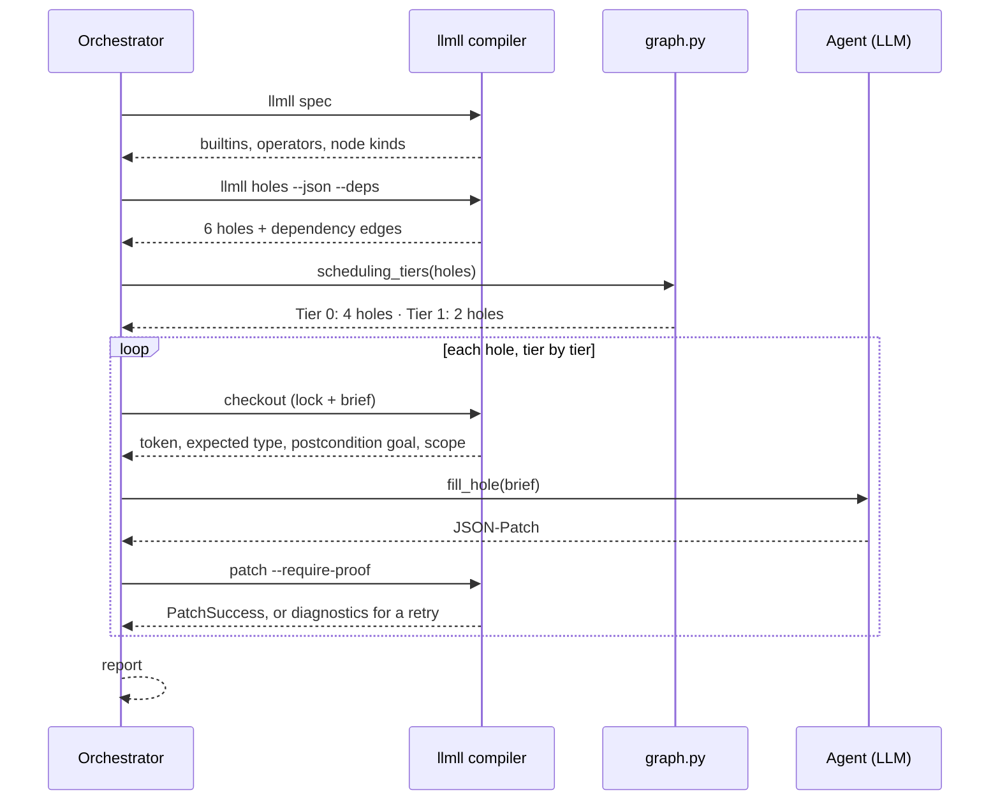

# Compiler-Mediated LLM Orchestration: From Typed Skeletons to Verified Programs

### How LLM agents fill code holes, and which fills the solver proves

> **The orchestrator is a compile-time, dependency-driven scheduler:** it asks the compiler to extract typed holes and their dependencies from a partial program, dispatches each hole to the assigned agent, and commits only patches that re-type-check and, where the hole has a postcondition, re-verify.

This walkthrough fills a six-hole authentication module with three agents. Three
holes are authentication *decisions* with postconditions, and the solver proves
every fill of them. The other three are string and `Result` plumbing with no
postcondition, and nothing checks what their fills do beyond the types. The
walkthrough shows both halves, because the second half is where an accepted fill
can still be wrong.

Every command output below was produced by `llmll 0.26.9` run from `docs/`
against a copy of [`examples/orchestrator_walkthrough/`](../examples/orchestrator_walkthrough/)
(`verify` writes a `.verified.json` sidecar next to its input, and `checkout`
writes a lock file). The live-fill output in Step 6 comes from one
`--provider anthropic --require-proof` run on the same skeleton.

---

## Why This Matters

Multi-agent code generation usually coordinates at the task level: one agent
writes the database layer, another the API, and incompatibilities surface at
integration time. A language with *typed holes* gives three things instead:

1. **A specification for each agent.** Every hole carries the type its fill must
   have and, when the function has one, the postcondition its fill must meet.
2. **A dependency ordering for scheduling.** The compiler's call-graph analysis
   derives a DAG of holes. Holes that do not depend on each other can be filled
   in parallel.
3. **A check on every fill.** The compiler re-type-checks the whole program after
   each patch and, for a function with a postcondition, re-runs the solver on the
   patched body. A bad fill is rejected with a structured diagnostic.

The third point has a limit this walkthrough makes concrete: the solver can only
check a function that has a postcondition, and only when its body is inside the
decidable fragment. Outside that, a fill is accepted on its type alone.

Orchestration happens *before* execution. The compiler extracts the dependency
graph from typed holes, and that graph fixes the fill order ahead of time. The
system is closer to a build planner plus patch executor than to a conversational
agent router.

---

## Conceptual Model

| Engineering term | Formal analogue |
|---|---|
| `?delegate` hole | **Metavariable** in a partial proof term: a placeholder with a known type that must be filled with a term of that type |
| Hole dependency graph | **Obligation ordering**: which goals must be solved before others |
| `checkout` + `patch` | **Exclusive term-refinement step**: one agent refines a given metavariable at a time |
| Re-type-check on patch | **Typing judgment** Γ ⊢ e : τ, where Γ is the in-scope bindings and τ the hole's expected type |
| Re-verify on patch | **Refinement check**: the patched body must entail the function's postcondition |
| Retry with diagnostics | **Counterexample-guided synthesis (CEGIS)**: the compiler rejects a candidate and its diagnostic guides the next attempt |

---

## What You'll Build

A multi-agent authentication system with three specialist agents:

| Agent | Holes |
|---|---|
| `@crypto-agent` | `hash-password-impl`, `token-valid?`, `hash-ok?` |
| `@gateway-agent` | `decide`, `authenticate-request` |
| `@session-agent` | `login-handler` |

The module splits into two kinds of function:

| Function | Contract | What `verify` says about the filled body |
|---|---|---|
| `token-valid?` | `post`: true exactly when the token has at least 8 characters | proved |
| `hash-ok?` | `post`: true exactly when the hash is not the fallback `"hash-unavailable"` | proved |
| `decide` | `post`: fixes `Reuse` / `Fresh` / `Deny` for every input | proved |
| `hash-password-impl` | none | unspecified |
| `login-handler` | `pre` only (non-empty password) | pre asserted, no post |
| `authenticate-request` | none | unspecified |

The decisions carry the security logic, so they are the functions with
postconditions. The plumbing builds strings and `Result` values, which the
solver cannot reason about today (see [Why the plumbing has no postcondition](#why-the-plumbing-has-no-postcondition)).

The holes fall into two scheduling tiers:

```
Tier 0 (parallel):  hash-password-impl  token-valid?  hash-ok?  decide
Tier 1 (parallel):  login-handler         (calls hash-password-impl)
                    authenticate-request  (calls token-valid?, hash-password-impl, decide, hash-ok?)
```

---

## Before We Start

```bash
# Build the compiler (GHC >= 9.4, Stack >= 2.9)
cd compiler && stack build

# Install the orchestrator
cd tools/llmll-orchestra && pip install -e .

# Set your API key
export ANTHROPIC_API_KEY=sk-ant-...
```

---

## Step 1: Write the Skeleton

The lead agent writes the program structure. Every body an agent should write is
a `?delegate` hole. The full program in S-expression form:

```lisp
(def-interface AuthSystem
  [hash-password (fn [raw-pw: string] -> string)]
  [token-valid   (fn [token: string] -> bool)])

(type Decision
  (| Reuse)
  (| Fresh)
  (| Deny))

(def hash-password-impl [raw-pw: string] -> string
  (?delegate @crypto-agent "Hash the raw password using a salt-based scheme. Concatenate a fixed salt with the password, compute a digest representation, and return the hashed string prefixed with 'hashed:'." -> string
    (on-failure "hash-unavailable")))

(def token-valid? [token: string] -> bool
  (post (= result (>= (string-length token) 8)))
  (?delegate @crypto-agent "Decide whether the session token is well-formed: true exactly when it is at least 8 characters long." -> bool
    (on-failure false)))

(def hash-ok? [hashed: string] -> bool
  (post (= result (not (= hashed "hash-unavailable"))))
  (?delegate @crypto-agent "Decide whether hashing succeeded: true exactly when hashed is not the fallback value 'hash-unavailable'." -> bool
    (on-failure false)))

(def decide [token-ok: bool hash-ok: bool] -> Decision
  (post (and (=> token-ok (= result Reuse))
             (and (=> (and (not token-ok) hash-ok) (= result Fresh))
                  (=> (and (not token-ok) (not hash-ok)) (= result Deny)))))
  (?delegate @gateway-agent "Decide the authentication outcome: Reuse when the existing token is valid, otherwise Fresh when the password hashed, otherwise Deny." -> Decision
    (on-failure Deny)))

(def-shell login-handler [username: string password: string]
  (pre (not (string-empty? password)))
  (let [[hashed (hash-password-impl password)]]
    (?delegate @session-agent "Using the hashed password (bound as 'hashed') and the username, build a session token string. If (hash-ok? hashed) is false, return an error. Otherwise concatenate username, ':', and hashed into a session ID and return it wrapped in ok. Return Result[string, string]." -> Result[string, string]
      (on-failure (err "session-agent unavailable")))))

(def-shell authenticate-request [username: string password: string existing-token: string]
  (let [[token-ok (token-valid? existing-token)]
        [hashed (hash-password-impl password)]
        [outcome (decide token-ok (hash-ok? hashed))]]
    (?delegate @gateway-agent "Route on outcome (a Decision from decide). Reuse: return ok with existing-token. Fresh: return the result of (login-handler username password). Deny: return err. Return Result[string, string]." -> Result[string, string]
      (on-failure (err "gateway-agent unavailable")))))
```

Things to notice:

- **`?delegate`** is a typed hole: it names the agent, gives an instruction, and
  declares the return type the fill must have.
- **`post`** on `token-valid?`, `hash-ok?` and `decide` is what the solver checks.
  The instruction string is prose for the agent; the `post` is the part the
  compiler enforces. Each instruction restates its `post` so the agent aims at it.
- **`Decision`** is a sum of three nullary constructors. Equality with a nullary
  constructor is inside the decidable fragment, so `decide`'s postcondition can
  name every outcome.
- **`on-failure`** is the runtime fallback if an agent is unavailable at run time.
  It has nothing to do with orchestration-time filling.
- **Dependencies come from calls outside a hole.** `authenticate-request`'s `let`
  calls four functions whose bodies are holes, so its hole waits for them.

The JSON-AST is [`examples/orchestrator_walkthrough/auth_module.ast.json`](../examples/orchestrator_walkthrough/auth_module.ast.json).

```bash
$ llmll check ../examples/orchestrator_walkthrough/auth_module.ast.json
✅ ../examples/orchestrator_walkthrough/auth_module.ast.json — OK (8 statements)
```

Eight statements: one interface, one type, six functions. The skeleton already
type-checks because every hole declares its type and fallback. Verifying it shows
the decision contracts are present but not yet proved:

```bash
$ llmll verify ../examples/orchestrator_walkthrough/auth_module.ast.json
   body-fallback: token-valid?, hash-ok?, decide, login-handler
   Running liquid-fixpoint ...
⚠️  ../examples/orchestrator_walkthrough/auth_module.ast.json — SAFE (liquid-fixpoint), partial: 0 of 3 contracted functions proved; 3 assumed, not proved: token-valid?, hash-ok?, decide
   (--strict-verified-core fails on assumed functions)
```

(The `.fq written to` and `.verified.json written to` lines are omitted here and below.)

### Why the plumbing has no postcondition

On v0.26.9 the solver falls back, and assumes rather than proves a postcondition,
for each of these body and contract shapes:

- any body that calls `string-concat`;
- an `if` whose branches return a `Result`;
- a postcondition that compares `result` with a constructor carrying a string
  payload, such as `(= result (ok s))` (tracked as `STR-PAYLOAD-CTOR-1`).

Every plumbing function builds a string or returns a `Result`, so a postcondition
on it would be assumed, not proved. The skeleton leaves them without one and says
so, instead of carrying a contract that reads as checked.

---

## Step 2: Scan the Holes

```bash
$ llmll holes ../examples/orchestrator_walkthrough/auth_module.ast.json
../examples/orchestrator_walkthrough/auth_module.ast.json — 6 holes (0 blocking)
  [AGENT] ?delegate @crypto-agent in def hash-password-impl
  [AGENT] ?delegate @crypto-agent in def token-valid?
  [AGENT] ?delegate @crypto-agent in def hash-ok?
  [AGENT] ?delegate @gateway-agent in def decide
  [AGENT] ?delegate @session-agent in def-shell login-handler
  [AGENT] ?delegate @gateway-agent in def-shell authenticate-request
```

With `--json --deps` the compiler also reports each hole's dependencies. Selected
fields per hole:

```bash
$ llmll --json holes --deps ../examples/orchestrator_walkthrough/auth_module.ast.json
```

```json
{"pointer": "/statements/2/body", "agent": "@crypto-agent", "module-path": "def hash-password-impl", "depends_on": [], "cycle_warning": false}
{"pointer": "/statements/3/body", "agent": "@crypto-agent", "module-path": "def token-valid?", "depends_on": [], "cycle_warning": false}
{"pointer": "/statements/4/body", "agent": "@crypto-agent", "module-path": "def hash-ok?", "depends_on": [], "cycle_warning": false}
{"pointer": "/statements/5/body", "agent": "@gateway-agent", "module-path": "def decide", "depends_on": [], "cycle_warning": false}
{"pointer": "/statements/6/body/body", "agent": "@session-agent", "module-path": "def-shell login-handler", "depends_on": [{"pointer": "/statements/2/body", "reason": "calls-hole-body", "via": "hash-password-impl"}], "cycle_warning": false}
{"pointer": "/statements/7/body/body", "agent": "@gateway-agent", "module-path": "def-shell authenticate-request", "depends_on": [{"pointer": "/statements/3/body", "reason": "calls-hole-body", "via": "token-valid?"}, {"pointer": "/statements/2/body", "reason": "calls-hole-body", "via": "hash-password-impl"}, {"pointer": "/statements/5/body", "reason": "calls-hole-body", "via": "decide"}, {"pointer": "/statements/4/body", "reason": "calls-hole-body", "via": "hash-ok?"}], "cycle_warning": false}
```

The `pointer` is an RFC 6901 JSON Pointer into the AST. The two `def-shell` holes
sit at `.../body/body` because each function body is a `let` and the hole is the
`let`'s inner body; the bindings stay in place and are in scope for the fill.

`authenticate-request` does not depend on `login-handler`: its skeleton never
calls `login-handler` outside the hole (the instruction asks the fill to call it),
so no edge exists. Both `def-shell` holes land in Tier 1.

### How does the compiler know about dependencies?

**Stage 1, cycle detection (compiler, Haskell).** [`HoleAnalysis.hs`](../compiler/src/LLMLL/HoleAnalysis.hs)
walks the call graph and adds an edge when a function's code outside its hole
calls a function whose body is a hole. Transitive calls through non-hole functions
create transitive edges. Tarjan's SCC algorithm detects cycles; a cycle is broken
deterministically and marked `cycle_warning: true`.

**Stage 2, topological sort (orchestrator, Python).** `graph.py` runs Kahn's
algorithm over the edges to produce scheduling tiers.

**Parallel filling is sound** because a hole's typing context Γ comes from its
position in the AST, not from sibling hole bodies, and `checkout` gives each agent
exclusive access to one subtree.

---

## Step 3: Schedule and Sort

You can see the plan without any API call:

```bash
$ llmll-orchestra ../examples/orchestrator_walkthrough/auth_module.ast.json --scan-only
../examples/orchestrator_walkthrough/auth_module.ast.json — 6 holes (6 fillable)

  Tier 0 (parallel):
    /statements/2/body [@crypto-agent]
    /statements/3/body [@crypto-agent]
    /statements/4/body [@crypto-agent]
    /statements/5/body [@gateway-agent]
  Tier 1 (parallel):
    /statements/6/body/body [@session-agent] ← depends on: hash-password-impl
    /statements/7/body/body [@gateway-agent] ← depends on: token-valid?, hash-password-impl, decide, hash-ok?
```


```mermaid
graph TD
    A["/statements/2/body<br/>hash-password-impl<br/>@crypto-agent"]
    B["/statements/3/body<br/>token-valid? (post)<br/>@crypto-agent"]
    C["/statements/4/body<br/>hash-ok? (post)<br/>@crypto-agent"]
    D["/statements/5/body<br/>decide (post)<br/>@gateway-agent"]
    E["/statements/6/body/body<br/>login-handler<br/>@session-agent"]
    F["/statements/7/body/body<br/>authenticate-request<br/>@gateway-agent"]

    A --> E
    A --> F
    B --> F
    C --> F
    D --> F
```

---

## Step 4: What the Agent Sees

For each hole the orchestrator runs one loop: **checkout** (lock the hole and get
its brief), **prompt** the agent, **patch** (the compiler re-type-checks and
re-verifies), and **retry** with the compiler's diagnostic if the patch is rejected.

The checkout brief is the agent's specification. Selected fields for `decide`:

```bash
$ llmll --json checkout ../examples/orchestrator_walkthrough/auth_module.ast.json /statements/5/body
```

```
pointer               "/statements/5/body"
hole_kind             "hole-delegate"
expected_return_type  "Decision"
postcondition_goal    "(and (=> token-ok (= result Reuse)) (and (=> (and (not token-ok) hash-ok) (= result Fresh)) (=> (and (not token-ok) (not hash-ok)) (= result Deny))))"
type_definitions      [{"constructors": [{"name": "Reuse"}, {"name": "Fresh"}, {"name": "Deny"}], "kind": "sum", "name": "Decision"}]
```

The brief also lists `in_scope` (the parameters `token-ok` and `hash-ok`, the
constructors, and the module's functions with their types) and
`available_functions` (each function's signature, `pre`, `post` and fill status).
The system prompt around the brief is not hardcoded: at startup the orchestrator
calls `llmll spec` for the compiler's list of builtins, operators and AST node
kinds.

---

## Step 5: The Patch Gate

`llmll patch` applies the agent's RFC 6902 patch and checks the whole program.
For a function with a postcondition it also runs the solver on the patched body.
Run with `--require-proof`, the orchestrator passes that flag to `patch`, which
adds one more refusal. Three patches to checked-out holes show the three outcomes.

**A wrong body is refuted.** A `decide` that answers `Fresh` whenever the token is
invalid, without looking at `hash-ok` (a fail-open bug):

```lisp
(if token-ok Reuse Fresh)
```

```
{"diagnostics":[{"holeSensitive":false,"kind":"lh-unsafe","message":"body verification of 'decide' failed (else-branch does not satisfy postcondition) (constraint #1)","pointer":"patch-op/0","severity":"error"}],"result":"PatchVerifyError"}
```

Exit 1, nothing written, lock kept. The orchestrator feeds the diagnostic to the
agent as `prior_diagnostics` and retries (up to `--max-retries`, default 3).

**A correct body is proved.** The same token, a correct `decide`:

```lisp
(if token-ok Reuse (if hash-ok Fresh Deny))
```

```
{"result":"PatchSuccess","reuse_suggestions":[],"statements":8,"verification":[{"body_faithful":true,"fn":"decide"}]}
```

`body_faithful: true` means the solver checked the body itself against the
postcondition.

**A correct body outside the fragment is refused under `--require-proof`.** This
`token-valid?` returns the right answer for every input, but its `if` tests
`string-empty?`, which the solver cannot model:

```lisp
(if (string-empty? token) false (>= (string-length token) 8))
```

```
{"diagnostics":[{"message":"'token-valid?' passed the solver but was not proved: body-outside-fragment (outside the decidable fragment: if), so its postcondition was assumed. Rewrite the body without those constructs."}],"result":"PatchNotProved","verification":[{"body_faithful":false,"fallback_cause":"body-outside-fragment","fallback_constructs":["if"],"fn":"token-valid?"}]}
```

Without `--require-proof` this patch succeeds and the function's postcondition is
recorded as assumed. With it, the agent is told to rewrite, and
`(>= (string-length token) 8)` is proved.

A hole whose function has no postcondition (the three plumbing holes) passes the
gate on types alone. That is the subject of the next step.

---

## Step 6: The Live Run

One run with Claude filling every hole:

```bash
$ llmll-orchestra ../examples/orchestrator_walkthrough/auth_module.ast.json \
    --provider anthropic --require-proof -v
```

```
════════════════════════════════════════════════════════════
  llmll-orchestra report: .../auth_module.ast.json
════════════════════════════════════════════════════════════
  Total holes:  6
  Filled:       6
  Failed:       0
  Skipped:      0
────────────────────────────────────────────────────────────
  ✅ /statements/2/body [@crypto-agent]  (2 attempts)
  ✅ /statements/3/body [@crypto-agent]  (1 attempts)
  ✅ /statements/4/body [@crypto-agent]  (1 attempts)
  ✅ /statements/5/body [@gateway-agent]  (1 attempts)
  ✅ /statements/6/body/body [@session-agent]  (1 attempts)
  ✅ /statements/7/body/body [@gateway-agent]  (1 attempts)
════════════════════════════════════════════════════════════
```

The first attempt at `hash-password-impl` was rejected with
`body contains non-core syntax — lambda, do, await, non-linear arithmetic, or unrestricted match; use def-shell for permissive bodies`,
and the second attempt was accepted.

**The three decisions are proved.** The agent's fills:

```lisp
token-valid?:  (>= (string-length token) 8)
hash-ok?:      (not (= hashed "hash-unavailable"))
decide:        (if token-ok Reuse (if hash-ok Fresh Deny))
```

Verifying the filled copy recorded `body_faithful: true` and level `verified`
for all three.

**The plumbing is accepted on types alone, and it is wrong.** The accepted
`hash-password-impl`:

```lisp
(if (string-empty? raw-pw) "hash-unavailable" (string-concat "sha1$" raw-pw))
```

This is not a hash. It returns the password with a `sha1$` prefix. The type is
`string`, as declared, and the function has no postcondition, so the patch gate
had nothing else to check. The other two plumbing fills show the same gap:

- `login-handler` calls `(token-valid? username)`, so a username of 8 or more
  characters routes to `Reuse` and gets a session without the password being used.
- `authenticate-request` answers `Fresh` with `(ok (string-concat "token-" hashed))`
  instead of calling `login-handler`, so the returned token contains the raw
  password.

Every one of these fills type-checks, and each passed the same gate that proved
the decisions. That is what "unproved" means in practice: the compiler accepted
the fill, and nothing checked its behavior. A proof covers exactly the functions
with a postcondition whose body is inside the fragment.

---

## Step 7: Verify the Result

[`auth_module_filled.ast.json`](../examples/orchestrator_walkthrough/auth_module_filled.ast.json)
is the module with reviewed fills (its plumbing follows the instructions; it is
not the live run's output).

```bash
$ llmll check ../examples/orchestrator_walkthrough/auth_module_filled.ast.json
✅ ../examples/orchestrator_walkthrough/auth_module_filled.ast.json — OK (8 statements)

$ llmll holes ../examples/orchestrator_walkthrough/auth_module_filled.ast.json
../examples/orchestrator_walkthrough/auth_module_filled.ast.json — 0 holes (0 blocking)

$ llmll verify ../examples/orchestrator_walkthrough/auth_module_filled.ast.json
   body-faithful: token-valid?, hash-ok?, decide
   body-fallback: login-handler
   Running liquid-fixpoint ...
✅ ../examples/orchestrator_walkthrough/auth_module_filled.ast.json — SAFE (liquid-fixpoint)
```

`body-fallback: login-handler` is its `pre` with no `post` (fallback cause
`no-post`). Spec coverage shows the split:

```bash
$ llmll verify ../examples/orchestrator_walkthrough/auth_module_filled.ast.json --spec-coverage
Spec Coverage Report
────────────────────────────────────────────
  Functions with contracts:     4 / 6   (67%)
    Verified:                   3
    Tested:                     0
    Asserted:                   1
  Unspecified:                  2
    hash-password-impl, authenticate-request
────────────────────────────────────────────
  Effective coverage: 67% (4/6)
```

`--trust-report` shows what each caller relies on:

```
  authenticate-request:
    pre:  —  |  post: —
    ↳ calls token-valid? (pre: —, post: verified (liquid-fixpoint))
    ↳ calls decide (pre: —, post: verified (liquid-fixpoint))
    ↳ calls hash-ok? (pre: —, post: verified (liquid-fixpoint))
    ↳ calls login-handler (pre: asserted, post: —)
  ...
Summary:
  verified:         3
  tested:           0
  asserted:         0
  no contract:      3
```

Its summary counts `login-handler` under `no contract` because it has no `post`,
while spec coverage counts its `pre` as `Asserted`.

**Wrong decision bodies are refuted.** Each row is a one-line edit to the filled
file, then `llmll verify` (exit 1 each):

| Edit | Result |
|---|---|
| `token-valid?`: `>=` becomes `>` | `error: body verification of 'token-valid?' failed — implementation does not satisfy postcondition (constraint #0)` |
| `hash-ok?`: drop the `not` | `error: body verification of 'hash-ok?' failed — implementation does not satisfy postcondition (constraint #1)` |
| `decide`: `(if hash-ok Fresh (if token-ok Reuse Deny))` | `error: body verification of 'decide' failed (then-branch does not satisfy postcondition) (constraint #2)` |
| `decide`: `(if token-ok Reuse Fresh)` | `error: body verification of 'decide' failed (else-branch does not satisfy postcondition) (constraint #3)` |

No equivalent edit to a plumbing function is refuted, for the reason Step 6 shows.

---

## Under the Hood


```mermaid
sequenceDiagram
    participant O as Orchestrator
    participant C as llmll compiler
    participant G as graph.py
    participant A as Agent (LLM)

    O->>C: llmll spec
    C-->>O: builtins, operators, node kinds
    O->>C: llmll holes --json --deps
    C-->>O: 6 holes + dependency edges
    O->>G: scheduling_tiers(holes)
    G-->>O: Tier 0: 4 holes · Tier 1: 2 holes

    loop each hole, tier by tier
        O->>C: checkout (lock + brief)
        C-->>O: token, expected type, postcondition goal, scope
        O->>A: fill_hole(brief)
        A-->>O: JSON-Patch
        O->>C: patch --require-proof
        C-->>O: PatchSuccess, or diagnostics for a retry
    end

    O-->>O: report
```

The compiler is never bypassed: every patch goes through the same type checker
and solver as the rest of the program, and an agent cannot modify nodes outside
its checked-out subtree.

If every retry fails, the hole keeps its original body (`patch` is atomic), the
orchestrator releases the lock, and holes that depend on the failed one are
skipped. Independent holes proceed.

### The module map

```
tools/llmll-orchestra/llmll_orchestra/
  __main__.py       CLI entry: argparse, provider selection, scan-only, --mode plan|lead|auto
  compiler.py       Subprocess wrapper: spec(), holes(), checkout(), patch(), release()
  graph.py          topo_sort() via Kahn's algorithm, scheduling_tiers()
  agent.py          build_system_prompt(), build_prompt(), provider agents, DryRunAgent
  orchestrator.py   The main loop: spec → scan → sort → (checkout → fill → patch → retry)*
  lead_agent.py     Lead Agent: architecture plan from --intent, converted to a skeleton
  quality.py        Quality heuristics for a Lead Agent plan

compiler/src/LLMLL/
  AgentSpec.hs      Reads builtinEnv, emits the spec
  HoleAnalysis.hs   Hole scan, RFC 6901 pointers, dependency edges
```

---

## Related Work

**Typed holes.** Agda and Idris use typed holes for incremental proof
construction; GHC has typed holes (`_`); Hazel is a live environment built around
them. `?delegate` adds an agent assignment and a runtime fallback, and its
dependency graph is used for scheduling, not only for goal display.

**Synthesis from types.** Synquid and Myth synthesize programs from refinement
types by enumerative search. The orchestrator's retry loop is a degenerate CEGIS
with an LLM as the synthesizer and the type checker plus solver as the verifier.
The trade-off is completeness: an LLM may never find a valid fill, where a
solver-based synthesizer finds one or proves none exists.

**Multi-agent code generation.** ChatDev, MetaGPT and SWE-agent coordinate agents
through natural-language task protocols. Here coordination is derived from the
program's call graph, each task has a type and possibly a postcondition, and the
compiler is the arbiter.

**DAG schedulers.** Airflow and Bazel execute work in dependency order from a
graph the author declares. Here the graph is inferred from typed holes, and each
step is revalidated by the compiler before it is committed.

---

## Open Questions

- **First-attempt success.** On this module one live run filled 5 of 6 holes on
  the first attempt. One run is not a rate; larger programs and harder
  postconditions are untested here.
- **What the checks miss.** Types and postconditions catch what they state. The
  live run's plumbing fills are wrong in ways no contract in this module states.
  Moving more of that logic into provable functions, or widening the fragment to
  cover string construction, would close part of the gap.
- **Scale.** The orchestrator fills holes sequentially within a tier and works on
  one file. Programs with many holes need intra-tier parallelism and cross-file
  dependency tracking.

---

## Try It

```bash
# Scan only (no API calls)
llmll-orchestra examples/orchestrator_walkthrough/auth_module.ast.json --scan-only

# Dry run (stub patches, no API calls; tests the checkout/patch plumbing).
# A stub is not written to meet a postcondition, so expect the three
# decision holes to fail here.
llmll-orchestra examples/orchestrator_walkthrough/auth_module.ast.json --dry-run -v

# Live run; refuse any fill of a contracted function that is not proved
llmll-orchestra examples/orchestrator_walkthrough/auth_module.ast.json \
  --provider anthropic --require-proof -v

# Then check what was proved
llmll verify examples/orchestrator_walkthrough/auth_module.ast.json --spec-coverage
```

Run these on a copy: the orchestrator patches the file in place. The skeleton and
the reviewed filled module are in [`examples/orchestrator_walkthrough/`](../examples/orchestrator_walkthrough/).
